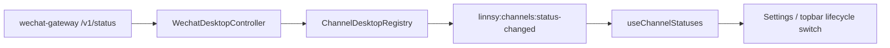

# Electron 桌面通道控制层

这一层是 daemon 侧 `ChannelAdapterPort` 在桌面壳里的镜像：daemon 负责“消息进出 Linnsy”，Electron main 负责“本机通道进程怎么启动、怎么登录、怎么把状态告诉 renderer”。

## 端口

- `ChannelDesktopController`：每个桌面通道一个控制器，提供 `start / stop / reconnectNetwork / deleteAccount / requestQrCode / setAutoConnect / getStatus / subscribe / dispose`。
- `ChannelDesktopStatus`：renderer 唯一消费的状态模型，核心字段是 `lifecycle`。
- `ChannelLifecycle`：`idle / starting / awaiting_login / connected / degraded`。前端只按这个枚举渲染，不再用多个 boolean 猜状态。

共享的 IPC 数据契约放在 `src/domains/desktop-integration/definitions/desktop-channel-contract.ts`；Electron 内部 controller port 放在 `electron/channels/types.ts`。

## 数据流

## WeChat 实现

WeChat 的 controller 是 `electron/channels/wechat/wechat-desktop-controller.ts`。它独占这些职责：

- 管理 `wechat-gateway` sidecar spawner。
- 读取 gateway `/v1/status`，把 `awaiting_qr_scan + qrLoginUrl` 映射成 `awaiting_login + loginHint`。
- 「查看二维码」走 `request-qr-code`，controller 调 gateway `POST /v1/qr-login/show`；gateway 每次生成新二维码，不复用旧二维码。
- 启动前先探测已有 gateway；如果同一个本地端口上已经有可读的 `/v1/status`，直接接管状态订阅，不再重复 spawn。若端口已有 gateway 但 bearer 不匹配，进入 `degraded` 提示检查 token。
- 删除账号走 `DELETE /v1/account`，由 gateway 在运行时清 `account.json`、`context-tokens.json`、deferred outbound 队列；controller 不再靠重启进程或 CLI `--delete-account` 切账号，也不把删除账号和生成二维码绑在一起。
- `delete-account` / `reconnect-network` 会打开短操作窗口；窗口里旧 sidecar 或 stale poll 回来的 `connected` 不会覆盖 `starting / awaiting_login / degraded`，避免 UI 在用户操作后闪回旧状态。
- 读写 `desktop-preferences.json` 里的 `channelAutoConnect.wechat`。
- 在用户 `start / stop / reconnect-network / delete-account / request-qr-code` 时同步切换 daemon 的 `LINNSY_DESKTOP_WECHAT_CONNECT`。
- 只在状态变化时向 renderer push，避免 renderer 3 秒轮询和日志刷屏。

## 添加新通道

1. 在 `src/domains/desktop-integration/definitions/desktop-channel-contract.ts` 复用通用状态契约；不要新增平台专属 IPC。
2. 在 `electron/channels/<channel>/` 下实现 controller，把进程、登录、偏好、状态轮询关在同一处。
3. 在 `ChannelDesktopRegistry` 注册 controller；registry 会统一转发所有 controller 的状态变化，即使 controller 在 IPC 订阅之后注册，也不会丢 push。
4. renderer 通过 `useChannelStatuses()` 读取状态，通过 `invokeChannelAction()` 发动作。
5. 平台专属 UI 只放在设置页对应分支里，不让 `AppShell` 持有平台状态机。
6. 更新 `docs/ADDING_A_PLATFORM.md` 和 `模块说明`。

## Sidecar 生命周期与孤儿治理

桌面壳里所有由 controller 拉起的 sidecar（当前是 `wechat-gateway`，未来还会有 Telegram 桥等）必须接入两层防御，避免出现"app 关了 sidecar 还活着、UI 显示 stale connected"的孤儿故障：

1. **统一退出路径**：`electron/shutdown.ts` 暴露 `createShutdownCoordinator()`。`main.ts` bootstrap 时把 `channelRegistry.disposeAll()` / `daemon.stop()` / `tray.destroy()` 注册成 named handler。`before-quit`（覆盖 ⌘Q / dock 退出 / Alt+F4 / `window-all-closed`）和 IPC `linnsy:app-quit`（renderer 主动退出）都调同一个 `coordinator.run(reason)`。`run()` 是 idempotent，5 秒总超时保证某个 handler hang 住时仍能退出。**不要再给某条新退出路径单独写一份清理逻辑。**
2. **pidfile 兜底**：sidecar 启动时把 `{ pid, startedAt, bind, bearerHash }` 写到状态目录的 `gateway.pid`，正常退出时 unlink。Electron 启动期通过 `inspectDesktopWechatGatewayPidfile()` 检查：stale（PID 已不存在）自动删，live（上次没干净退）只打 warning 让用户主动决定，**不自动 SIGTERM**——避免误杀用户在另一个终端故意启动的调试 sidecar。`bearerHash` 是 sha256 前 12 个十六进制字符，用于识别"是不是同一个 token 的进程"，不可反推。

WeChat 实现里 pidfile 落在 `{config.home}/wechat-gateway/gateway.pid`，由 `src/domains/channel/features/wechat/gateway/pidfile-store.ts` + `pidfile-inspector.ts` 提供。新通道接入 sidecar 时复用同一对模块，路径格式 `{config.home}/<channel>-gateway/gateway.pid`。

## 反目标

- renderer 不持本地 channel 状态机。
- Electron main 不从 stdout 解析协议。
- `main.ts` 不留下平台私有模块作用域状态。
- 新平台不新增一组 `linnsy:<platform>-*` IPC。
- **新平台不绕过 `ShutdownCoordinator` 自己注册退出钩子**——出现新清理需求就在 bootstrap 里 `register('<name>', handler)`，不要直接挂 `app.on('before-quit', ...)`。
- **不在启动期自动 kill 检测到的 live pidfile 进程**——保留用户主动调试的余地；要清就让用户从 UI 或 CLI 显式触发。
